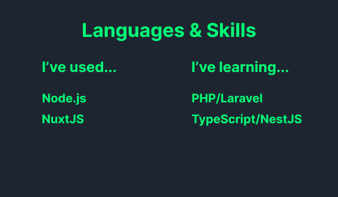

<!DOCTYPE html>
<html lang="en">
  <head>
    <meta charset="UTF-8" />
    <meta http-equiv="X-UA-Compatible" content="IE=edge" />
    <meta name="viewport" content="width=device-width, initial-scale=1.0" />
    <title>Document</title>
  </head>
  <body>
    

    

      <h2 style="color: #06ff06">Hi there👋</h2>
      

        Thanks for visiting my github page! My name is Tomoya Hiroe. I'm
        majoring Economics at Yokohama National University.
      

      

        I wanna know how the things we use work and make them myself. That's why
        I started to learn programming. I'm currently learning backend
        programming with TypeScript.
      

      
Other areas of my interest are ...

      <ul>
        <li>📈Statistics and data science</li>
        <li>📚Behavioral Economics</li>
        <li>🎾Playing soft tennis</li>
        <li>📀Watching animes</li>
      </ul>
    

    

      <h2 style="color: #06ff06">Works💪</h2>
      <ul>
        <li>
          <a href="https://github.com/tomoyahiroe/mini_blog">mini_blog</a> :
          blog site made with Nuxt.js and microCMS(<a
            href="https://main.d1fxh0yqefm28c.amplifyapp.com/blog"
            >site link</a
          >)
        </li>
        <li>
          <a href="https://github.com/tomoyahiroe/contribution_meter"
            >contribution_meter</a
          >
          : this program can measure user's contributions on your ternimal
        </li>
      </ul>
    

    

      <h2 style="color: #06ff06">Active repositories💨</h2>
      <ul>
        <li>
          <a href="https://github.com/tomoyahiroe/mini_blog">mini_blog</a> :
          blog site made with Nuxt.js and microCMS(<a
            href="https://main.d1fxh0yqefm28c.amplifyapp.com/blog"
            >site link</a
          >)
        </li>
        <li>
          <a href="https://github.com/tomoyahiroe/todoapp"
            >todoapp</a
          >
          : todoapp made with express.js
        </li>
      </ul>
    

  </body>
</html>
